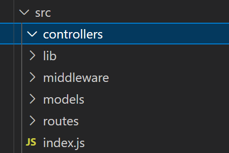
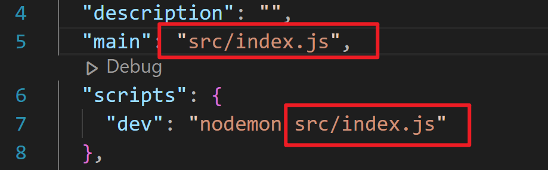

## 生成 package.json 文件

> npm init -y

## 安装依赖

> npm i express mongoose dotenv jsonwebtoken bcryptjs cookie-parser cloudinary socket.io

> npm i nodemon -D

## 修改 package.json 中的 scripts 和 type
```json
{
  ... ...
  "scripts": {
    "dev": "nodemon index.js"
  },
  ... ...
  "type": "module",
  ... ...
}

```

## 新建 index.js 文件
```js
import express from 'express'
const app = express()

app.listen(5001, () => {
  console.log('server is running on port 5001');
})
```

## 创建 src 及对应的文件夹


🎯因为上面修改了 index.js 的文件路径，所以 package.json 中也需要做对应的修改（修改后需要重启服务器）


## 建立测试接口
index.js
```js
import authRoutes from './routes/auth.route.js'
import express from 'express'

const app = express()

app.use("/api/auth", authRoutes)

app.listen(5001, () => {
  console.log('server is running on port 5001');
})
```
auth.route.js
```js
import express from 'express'

const router = express.Router()

router.get('/getData', (req, res) => {
  res.send('getData route')
})

export default router
```
就可以去访问 `http://localhost:5001/api/auth/getData` 啦

## 使用 controller
如果将每个接口的处理逻辑都放到 route 中，会导致文件内容看起来很繁琐，所以将每个接口的处理逻辑都放置到 controller 中
index.js
```js
import express from 'express'
import { signup, login, logout } from '../controllers/auth.controller.js'

const router = express.Router()

router.post('/signup', signup)
router.post('/login', login)
router.post('/logout', logout)

export default router
```
auth.controller.js
```js
export const signup = (req, res) => {
  res.send('signup route')
}

export const login = (req, res) => {
  res.send('signup route')
}

export const logout = (req, res) => {
  res.send('signup route')
}
```